# Escaping Legacy Database Constraints: Modernize Business Rule Processing with AWS Cloud Technologies

## Overview
This repository demonstrates modern approaches to transform legacy business rule processing systems into contemporary application architectures. It specifically focuses on modernizing analytics and reporting applications that traditionally rely on OLTP database tables and stored procedures.

## Background
The project uses a car insurance system as an example case study. The legacy system architecture consists of:

- A SQL Server database (InsuranceDB) storing:
  - Policy information
  - Driver details
  - Vehicle data
  - Insurance request records

- A data processing application that:
  - Executes SQL jobs in the database
  - Uses stored procedures with database links to fetch data from InsuranceDB into the premium processing database
  - Implements business rules within stored procedures for premium calculations
  - Feeds calculated premiums to a reporting system for visualization

<a name="legacy-arch">
    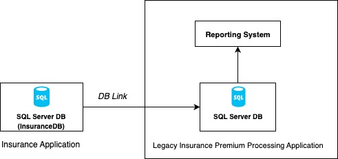
</a>
* Figure 1: Legacy Architecture Diagram*

## Purpose
This modernization framework provides patterns and strategies to decompose such legacy applications into scalable, maintainable, and modern architectures while preserving core business functionality.

As shown in [Figure 1](#legacy-arch), the legacy system consists of DB link based integration of two applications Insurance Application and Legacy Insurance Premium Processing Application. We will modernize the right side of this diagram to achieve complete freedom from the SQL server database for the insurance premium processing application through modernizing the businss rule based data processing on AWS using a serverless framework.
<a name="target-arch">
    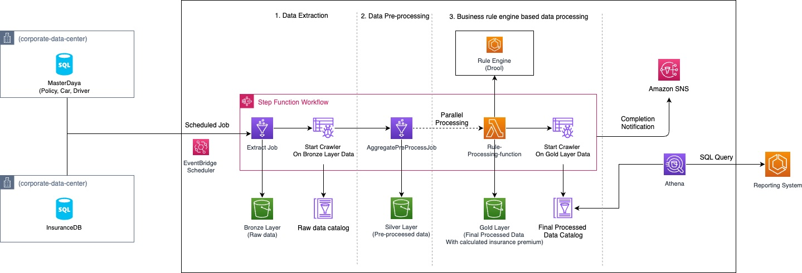
</a>
* Figure 2: Modernized Architecture Diagram*

The strategy to modernize such application is discussed in the blog [Escaping Legacy Database Constraints: Modernize Business Rule Processing with AWS Cloud Technologies]. The data ingestion from the InsuranceDB database is achieved through Glue job using Glue jdbc connection in order to populate the bronze layer S3 bucket. The data processing pipeline is orchestrated through AWS Step function. Here we adopted a medallion lakehouse architecture with three layers. i) Raw and unprocessed data is stored in bronze layer S3 bucket, ii) pre-processed and aggregated data in the silver layer S3 bucket and iii) the final processed data for the reporting application is stored in the gold layer S3 bucket. The business rule based insurance premium calculation for each records are done with massively parellal processing through the distributed map feature of the AWS step function. The final processed data is stored in gold layer S3 bucket and catalog database is created and updated using the AWS Glue Crawler.

To setup this in your local environment you need the below pre-requisites:

# Pre-requisites
* AWS CLI v 2.22 or above
* node v20.0.0 or above
* Use latest AWS cdk version. This project is using AWS CDK v2.1019.1.
* Apache Maven 3.9.9 or above is installed and configured
* Docker Desktop 4.38.0 or above is installed and running.
* Java17

Please note: Here we will be creating a SQL server environment for the InsuranceDB database and load some dummy data in order to replicate the entire scenario (left side of the [Figure 1](#legacy-arch) or  [Figure 2](#target-arch)).

# Steps to follow:

1. Run a git clone to copy the entire repository in your local system.</br>
2. Create a folder called "keypairs" in the project root. Here we will generate a key pair to associate with the SQL server database in order to login to the SQL server database instance.
    *   From the project root run `chmod 755 <<keypairs-folder-path>>`
    *   Run `chmod +x ./scripts/create-key-pair.sh`
    *   Create the key pair
        * For Mac system Run `./scripts/create-key-pair.sh <<aws-region-name>> <<aws-profile-name>>`

        After running this command you will see the key pair is generated inside the keypairs folder under the project root.</br>

3. Set environment variable to configure the email address where you want to send the notification email for the completion of the data processing workflow. Run  export NOTIFICATION_EMAIL= << your-email-id >> </br>
4. If you are configuring the CDK project inside MacBook system with M1 processor run `export DOCKER_CONTAINER_PLATFORM_ARCH=arm` using this we will create the ARM based docker container for AWS Graviton compatibility with AWS ECS and AWS Lambda function. Leave it blank if you want x86 based containers for Intel or AMD processors. </br> 
5. Go to the rule-engine-drool folder. From the project root run `cd ./rule-engine-drool` Then build the Drool rule engine `mvn clean install package`
6. Now return to the root folder. Build the foundation stack along with the rule engine drool AWS ECS cluster and the rule processing AWS lambda function. From the project root folder run  `cdk deploy FoundationStack RuleEngineStack RuleProcessingFunctionStack --profile <<profile-name>>`.</br>
7. Login to your AWS Console.After running the above cdk deployment you will see an AWS EC2 instance with name SQLServerDev is created. Connect to this instance using Fleet Manager. You will need to use the key pair created at the step#2 to log into the instance.</br>
8. Once you are in the SQLServerDev instance open the SQL server management studio and login using the Windows Authentication (Since this is a sample code and solely for demo purpose select the connection security encryption as Optional. For Prod environment you need to use trusted certificate to connect)
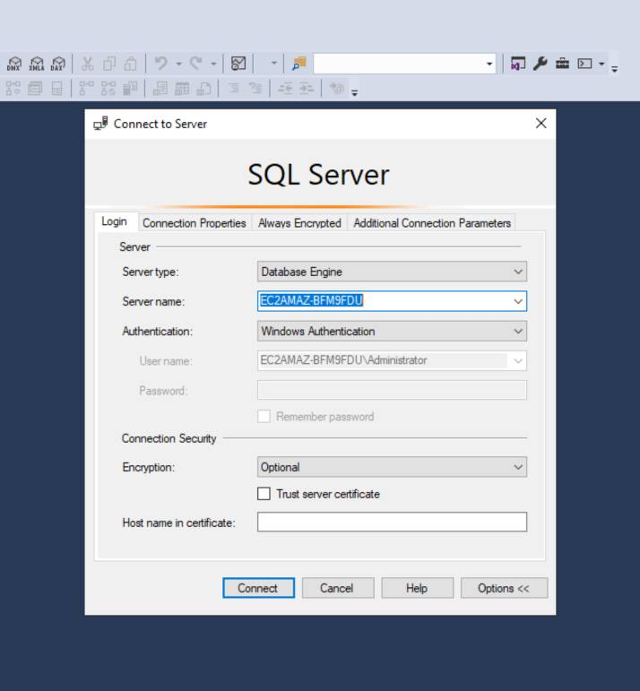
* Figure 3: SQL Server Login with Windows Authentication *</br>
9.  We will enable the sa login for the SQL Server. Click on Security —> Logins —> right click on sa and go to properties and set the sa password in General. Click on Status and enable the login. You need to remember the password you have set at this step.
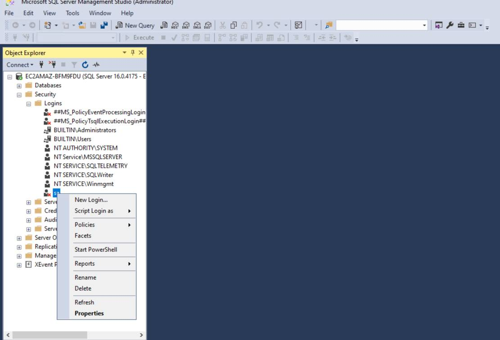
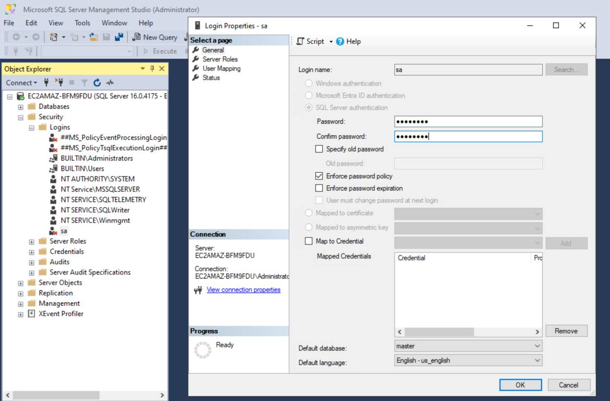
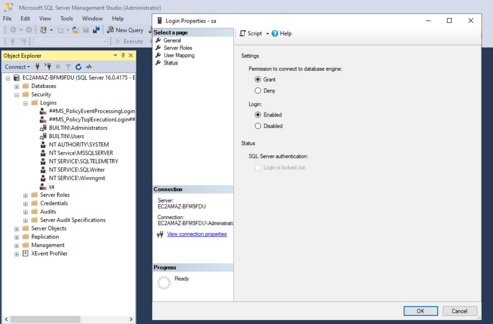</br>
10. In order to use the sa login for the SQL server, right click the Server and click on Properties. Under Security select the SQL Server and Windows Authentication mode. Click OK on the configuration confirmation popup.
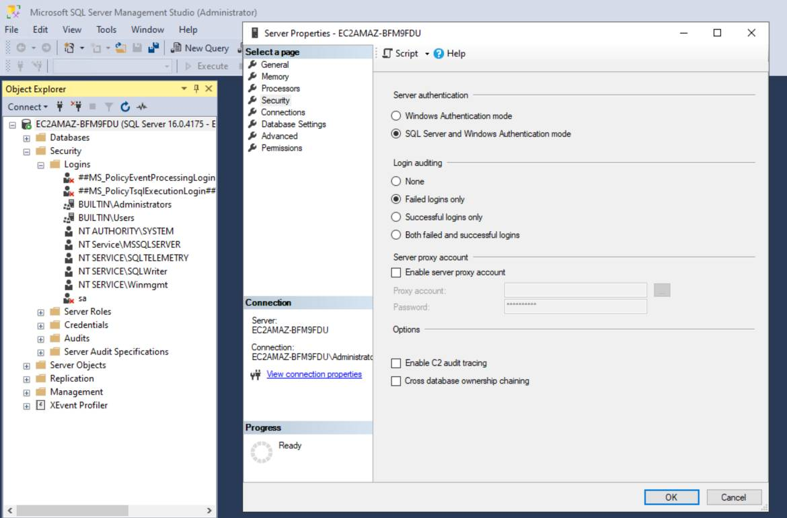</br>
11. Right click the server and click on Restart. After restart connect the server this time with SQL Server Authentication. Provide the login name sa and password as provided earlier
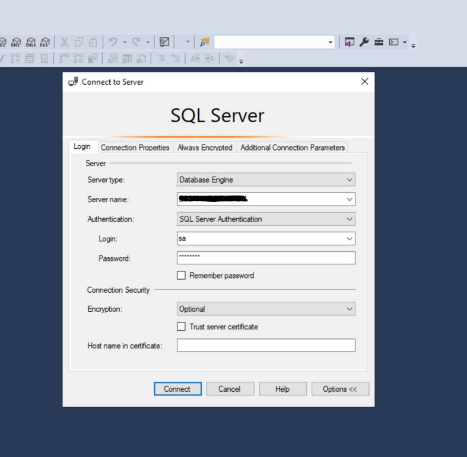</br>
12. Now create a new Database with name InsuranceDB. This is the database which will have the transaction data which will be pulled by the insurance data processing pipeline. We will create a schema and generate some dummy records for testing.</br>
13. Once the InsuranceDB database is created run the script name [create-and-load-data.sql](scripts/sql-script/create-and-load-data.sql) to create the required Schema, Tables and load the data. Successful execution of the script will create four tables Car, Driver, Policy and InsuranceRequest with 10000 records in each table.</br>
14. After successfult execution of the above script, you will see the 'Sales' schema is generated with four tables 'Car', 'Driver', 'Policy' and 'InsuranceRequest' with 10000 dummy records in each of them.
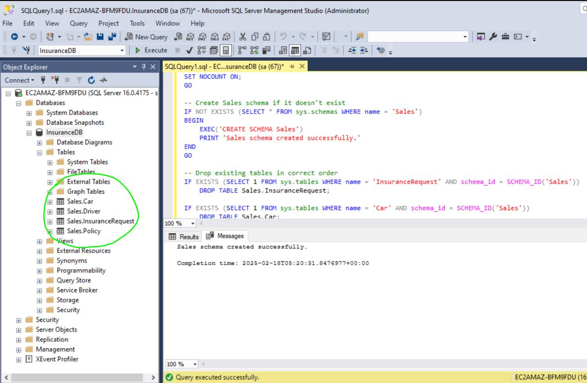</br>
15. Once the schema is created set up the below environment variables in your local system where you have setup the project and running the cdk deployment.
    `export SQL_SERVER_NAME=<< Your-sql-server-name >>`
    `export SQL_SERVER_USER=sa`
    `export SQL_SERVER_PASSWORD=<<Your-database-password>>`</br>
16. After setting these environment variables run the command `cdk deploy DataProcessingStack DataWorkflowStack --profile <your-aws-profile-name>` </br>
17. Press 'Yes' when prompted for resource deployment by AWS Cdk. </br>
18. Once the AWS SNS topic has been configured, you will receive email in your configured mail id at the step #3 to confirm SNS topic subscription.

# Validation:

1.  After the successful completion of the CDK deployment you will see the AWS Step function workflow is generated and AWS Event bridge schedular is also configured to run modernized data processing pipeline once in a day.
2.  Execute the Step function workflow manually to see how the insurance premium calculation takes place for 10K records which got generated in the SQL server database. Go to generated AWS Step Functions State machine with name starting with DataProcessingWorkflow and click on the Start Execution button.
3. After successful completion of the data processing workflow the calculated data is stored inside the Gold layer S3 bucket partitioned by year, month day and hour.
4. Open Amazon Athena console to run query on the generated data inside the Gold layer bucket and observe the calculated premiums based on the business rules configured in the Drools business rule engine.
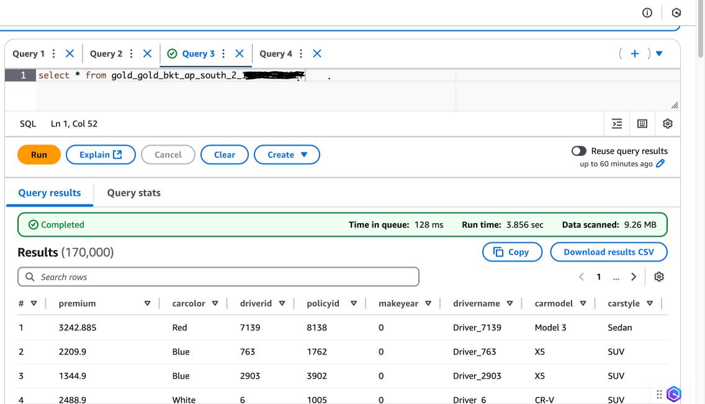
5. If you query the premium from the Policy table of the SQL server legacy DB for a policy id and check the same policy id from the Athena query editor running a SQL query on the Gold layer S3 bucket, you will find that the premium has been updated based on the Drools business rule engine running in Amazon ECS service and the data processing pipeline configured used AWS Step Function above. The data now is being stored in Amazon S3 object storage bucket instead of SQL Server relational database as part of this modernization.
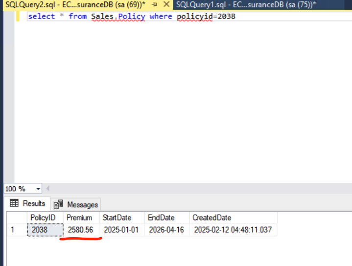
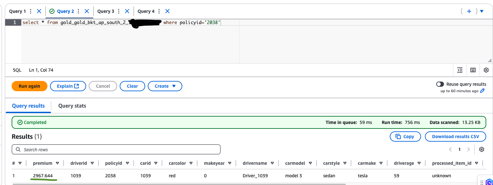
6. Job bookmark is enabled for the extract ETL AWS Glue jobs in order to avoid duplicate data processing. 
7. To process new set of data run the [load-new-data.sql](scripts/sql-script/load-new-data.sql) in the InsuranceDB database of the SQL Server to load another 5K data and executee the Step function workflow again manually to observe that only the newly added data has been processed.
8. After successful completion of the new data load, run the Step function workflow manually to see how the insurance premium calculation takes place for the new set of 5K records which got generated in the SQL server database.
9. If you want to reset the job bookmark in order to allow the duplicate processing you can run the below AWS CLI command `aws glue reset-job-bookmark --job-name <sql-extract-job-name> --profile <aws-profile-name> --region <region-name>`
10. The successful execution graph of the AWS Step Function State Machine looks like as below:
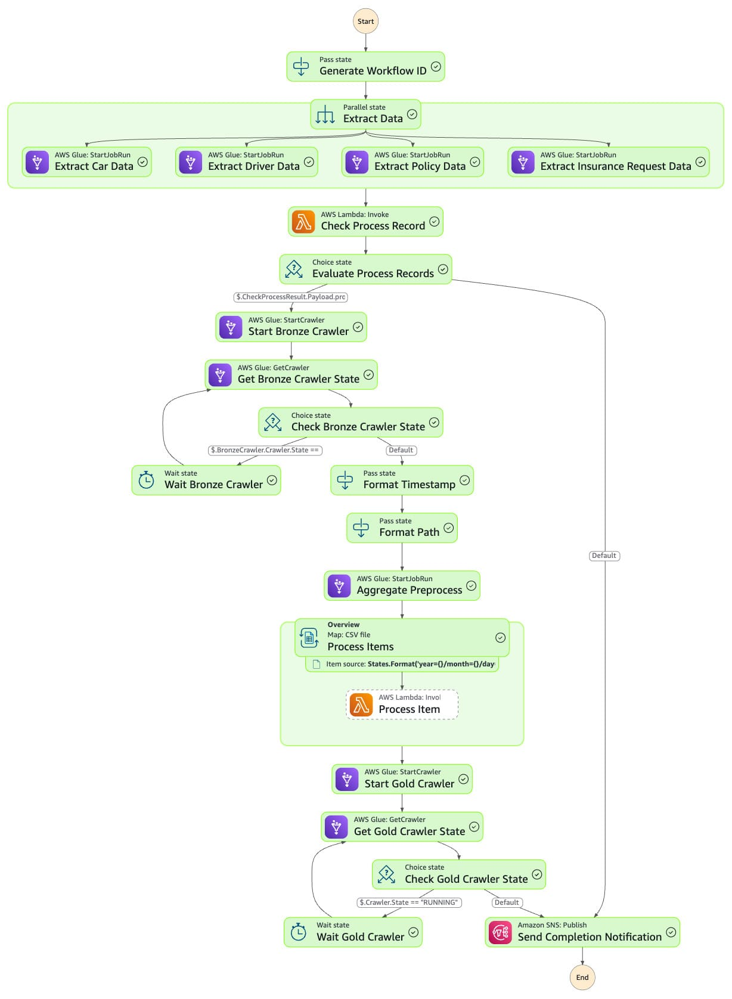
```markdown
# What is happening under the hood
1. When you execute the generated state machine workflow, successful completion of the entire workflow results in the graphical view shown below:
  - Data extraction from multiple tables in SQL Server is performed using AWS Glue Jobs leveraging AWS Glue JDBC Connection. These Glue jobs (Extract Car Data, Extract Driver Data, Extract Policy Data and Extract Insurance Request Data) are configured as parallel states inside the state machine workflow to execute concurrently. The extracted data is stored in the AWS S3 bronze layer bucket with table_name/year/month/day partitioning.
  - We utilize the AWS Glue job bookmark feature based on primary keys from SQL Server source tables to extract only newly generated data. Job metrics containing the source table name, last extracted data id, extraction time are stored in an Amazon DynamoDB table to ensure only new data is processed by the downstream systems.
  - The "Evaluate Process Records" Choice state in the state machine determines whether new data has arrived. If new data is detected, the workflow initiates crawling of the bronze layer S3 bucket to create/update the AWS Glue Data Catalog.
  - After Crawler completion, an aggregation pre-processing AWS Glue job executes Amazon Athena SQL queries on the bronze layer data to create aggregated data in the silver layer S3 bucket in CSV format with year/month/day partitioning.
  - We have implemented a Distributed Map state in the AWS Step Functions state machine to perform parallel business rule engine processing on the data.
  - The implementation performs concurrent batch processing with 100 records per batch (configured via Max Items Per Batch in the Map state) and invokes an AWS Lambda function from the "Process Item" state. This Lambda function creates the request payload for the Drools business rule engine running on Amazon ECS.
  - The final processed results are stored in the Amazon S3 gold layer bucket with year/month/day partitioning.
  - An AWS Glue crawler runs on the gold layer S3 bucket to create/update the AWS Glue Data Catalog, making the data queryable through Amazon Athena for reporting purposes.
```

# Next Step:

1. Customize and fine tune this data processing workflow based on your use case
2. The final data produced in the Gold layer bucket can be queried from the reporting application for displaying data in the generated reports.
3. For this demo only four sample rules for premium calculation are configured for car color 'blue' and 'red'. So you will find the policy premium for these Cars are modified than their corresponding value in the SQL server database


# Cleanup

To cleanup
1.  Empty the contents generated inside the silver, bronze and gold layer S3 bucket
2.  Run `cdk destroy --all --profile <your-aws-profile-name>`
